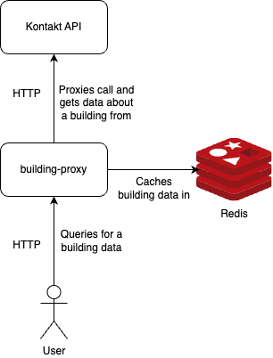

# building-proxy

`building-proxy` is a simple proxy `kontakt.io`'s
[Location & Occupancy API](https://developer.kontakt.io/docs/dev-ctr-loc-occ-api/c6bcb378b0df8-location-and-occupancy) to fetch the
buildings data and caches it in Redis.

The application is written in Java 21 using Gradle 8 and Spring Boot 3 with enabled Virtual Threads support.

Some kind of variation of the Clean Architecture has been used in the project to organise the code.

## Disclaimer

As it's quite not-so-easy to perform load tests (and meet requirements on a requests-per-second metric that the application should handle)
without having the access to the upstream API, a decision has been made to cache the data in Redis. Sure, Redis can be a bit overengineered
option for such a case - perhaps a `memcached` or even a simple in-memory cache would be enough (but for the last option each instance of
the application would have a separate cache what potentially can increase the traffic to the upstream API, but maybe it's not an issue).

## Architecture diagram



## Requirements

* Java 21 - preferable [Eclipse Temurin](https://adoptium.net/)
* Gradle - or use its wrapper `gradlew`
* container runtime - preferable [Colima](https://github.com/abiosoft/colima)

## Missing parts to be production-ready

* pipeline for building application Docker image based on the prepared `Dockerfile` and storing it in some kind of registry
  * for example, Docker Hub, GitHub Container Registry, etc.
* pipeline for deploying the application to given environments in a proper deployment place
  * for example, deploying to Kubernetes cluster needs a proper deployment descriptor or a Helm chart
* some kind of dashboard for monitoring the application based on the metrics provided by the application (i.e. default Micrometer metrics)
* production-ready `application.yaml` or `application-prod.yaml` file with
  * production-ready configuration for the `kontakt.io`'s REST client
    * url, credentials, timeouts, retries, etc.
  * production-ready configuration for the Redis cache client
    * url, credentials, timeouts, retries, ttls, etc.

### What's next?

* increase observability of the application via introducing `micrometer-tracing`
* limit Spring context reloads during integration tests to decrease their execution time
  * consider using
    [singleton containers](https://java.testcontainers.org/test_framework_integration/manual_lifecycle_control/)
  * potentially [reusable containers](https://java.testcontainers.org/features/reuse/) can be used as well but only
    for the local development
* prepare performance tests to check how the application behaves under the load using, using for example, `gatling`
* consider mapping GeoJsons to a proper data structure to make it easier to work with them, not just passing them through
  * for example using `jackson`'s [postgis-geojson](https://github.com/GeosatCO/postgis-geojson)
    or [geojson-jackson](https://github.com/opendatalab-de/geojson-jackson) extensions would be good enough

## Way of working

* run all tests with `./gradlew check`
* run unit tests with `./gradlew test`
* run integration and acceptance tests with `./gradlew testIntegration`
* check dependencies with `./gradlew dependencyUpdates`
* reformat code base `./gradlew ktlintFormat`
* perform static analysis `./gradlew detekt`

## Developers area

### Running locally

1. Run `docker compose up` to start all required services
2. Run `./gradlew bootRun --args='--spring.profiles.active=local'` to start the application with the `local` profile

### testcontainers with Colima

To use properly `testcontainers` with Colima, Add following environment variables to your shell profile (e.g.
`~/.bash_profile` or `~/.zprofile`):

```bash
export DOCKER_HOST="unix:///Users/$USER/.colima/default/docker.sock"
export TESTCONTAINERS_DOCKER_SOCKET_OVERRIDE="/var/run/docker.sock"
```

For more details see [docs](https://java.testcontainers.org/supported_docker_environment/)
and [this issue](https://github.com/testcontainers/testcontainers-java/issues/5034).

## Open API docs

The API is documented using OpenAPI and can be accessed under `/api-docs` path.

There is also a Swagger UI available under `/swagger-ui/index.html` path.

For local development they can be accessed via:

* `http://localhost:8080/api-docs/`
* `http://localhost:8080/swagger-ui/index.html`